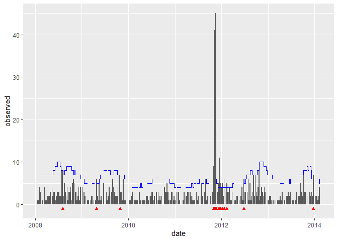

<!-- README.md is generated from README.Rmd. Please edit that file -->

# surveillanceExt

<!-- badges: start -->

<!-- badges: end -->

The goal of surveillanceExt is to …

## Installation

``` r
remotes::install_github("hoxo-m/surveillanceExt")
```

## Example

This is a basic example which shows you how to solve a common problem:

``` r
library(surveillanceExt)

data("salmNewport")
salmNewportGermany <- aggregate(salmNewport, by = "unit")
covariates <- ifelse(observed(salmNewportGermany) >= 40, 1, 0)

colnames(salmNewportGermany@observed) <- "y"
colnames(covariates) <- "x"

control <- list(noPeriods = 10, b = 4, w = 3, thresholdMethod = "nbPlugin")
fit <- farringtonFlexibleWithFormula(salmNewportGermany, y ~ x, covariates, control)
autoplot(fit)
```


